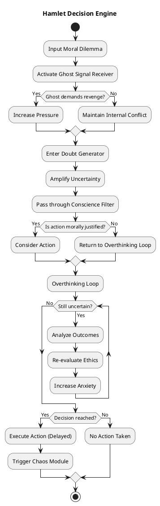

State diagram, state chart, state transition xxx

logic circuit -> CPU
 1bit cpu
 2bit CPU
 3bit CPU
 4bit CPU
 5bit CPU
 6bit CPU

computer software
  OS
  Game
  Web

communication device

  
printer device

Soroban(manual operation)

phisics
  material
　 * 5th state

Chemical

Biology

Social Science

literature

Q1 Please represent one famous literary work using a machine.
A2　
Here’s a creative way to represent a famous literary work as a “machine”:

---

### **“The Hamlet Decision Engine”**

**Based on:** *Hamlet* by William Shakespeare

**Machine Concept:**
A complex, looping decision-making machine that never quite reaches a final output.

**How it works:**

* **Input:** A moral dilemma (e.g., “Should I take revenge?”)
* **Core Components:**

  * **Doubt Generator:** Multiplies uncertainty with every cycle
  * **Conscience Filter:** Weighs ethics vs. action
  * **Ghost Signal Receiver:** Introduces external pressure or commands
  * **Overthinking Loop:** Recursively analyzes every possible outcome
* **Malfunction Module:** Triggers delays, contradictions, and emotional instability
* **Output:**

  * Either **no action**, or
  * A **delayed, chaotic resolution** with unintended consequences

**Special Feature:**
The longer the machine runs, the less likely it is to produce a clear answer.

---

If you want, I can build similar “machines” for other works (like *1984* as a surveillance system or *Pride and Prejudice* as a social compatibility algorithm).

Q2 please describe by plantuml
A2 
Here’s a **PlantUML diagram** representing the *Hamlet Decision Engine* machine:

**What this shows:**

* The **loops** represent Hamlet’s indecision
* The **branches** reflect moral conflict and external influence (the ghost)
* The **final outcomes** capture the tragedy: either paralysis or destructive action

If you want, I can also convert another literary work into a PlantUML diagram (sequence diagram, state machine, etc.).

   

